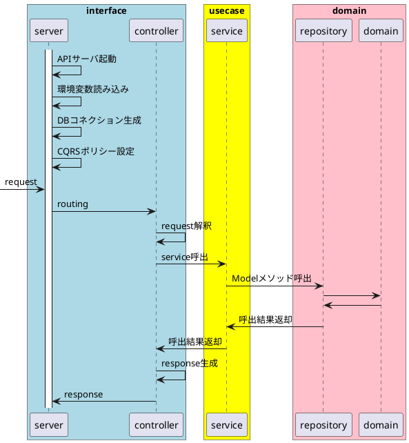
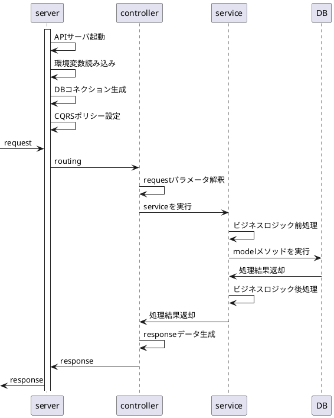

# AwesomeMusic-api サーバ

音楽サービス AwesomeMusic の API サーバ
https://github.com/oshou/Portfolio

## 概要

- JSON 形式でレスポンス
- 環境変数はレポジトリ直下の.env を読み込む
- Port8080 で受付

## 処理フロー

### ディレクトリ構成

- Makefile
  - タスクランナー
- main.go
  - エントリポイント
- go.mod, go.sum
  - Go パッケージ管理
- server/
  - API サーバ起動、ルーティング、環境変数読み込み、CQRS 対応
- controller/
  - リクエストの Parse,レスポンス生成
- db/
  - DB 接続
- entity/
  - DB テーブル定義
- facade/
  - ビジネスロジック
- .env.xxx
  - 環境変数
  - .env が利用される、利用時は.env.xxx を.env として別名コピーが必要
- Dockerfile
  - 実行環境作成用
  - Multi-Stage Build でビルドコンテナ、起動用コンテナを分けている
- .circleci
  - CI 関連

## 操作方法

- ビルド
  - make build_local
- バイナリ実行
  - make run
