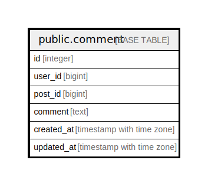

# public.comment

## Description

## Columns

| Name | Type | Default | Nullable | Children | Parents | Comment |
| ---- | ---- | ------- | -------- | -------- | ------- | ------- |
| id | integer | nextval('comment_id_seq'::regclass) | false |  |  | コメントID |
| user_id | bigint |  | false |  |  | ユーザーID |
| post_id | bigint |  | false |  |  | 投稿ID |
| comment | text |  | false |  |  | コメント本文 |
| created_at | timestamp with time zone | now() | false |  |  | 作成日時 |
| updated_at | timestamp with time zone | now() | false |  |  | 更新日時 |

## Constraints

| Name | Type | Definition |
| ---- | ---- | ---------- |
| comment_pkey | PRIMARY KEY | PRIMARY KEY (id) |

## Indexes

| Name | Definition |
| ---- | ---------- |
| comment_pkey | CREATE UNIQUE INDEX comment_pkey ON public.comment USING btree (id) |

## Relations

---

> Generated by [tbls](https://github.com/k1LoW/tbls)
