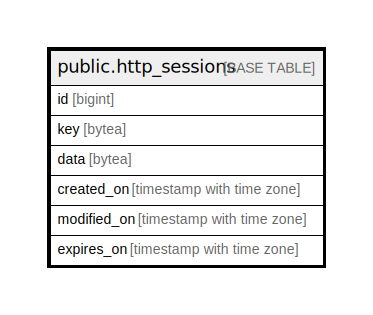

# public.http_sessions

## Description

## Columns

| Name | Type | Default | Nullable | Children | Parents | Comment |
| ---- | ---- | ------- | -------- | -------- | ------- | ------- |
| id | bigint | nextval('http_sessions_id_seq'::regclass) | false |  |  |  |
| key | bytea |  | true |  |  |  |
| data | bytea |  | true |  |  |  |
| created_on | timestamp with time zone | CURRENT_TIMESTAMP | true |  |  |  |
| modified_on | timestamp with time zone |  | true |  |  |  |
| expires_on | timestamp with time zone |  | true |  |  |  |

## Constraints

| Name | Type | Definition |
| ---- | ---- | ---------- |
| http_sessions_pkey | PRIMARY KEY | PRIMARY KEY (id) |

## Indexes

| Name | Definition |
| ---- | ---------- |
| http_sessions_pkey | CREATE UNIQUE INDEX http_sessions_pkey ON public.http_sessions USING btree (id) |

## Relations

---

> Generated by [tbls](https://github.com/k1LoW/tbls)
