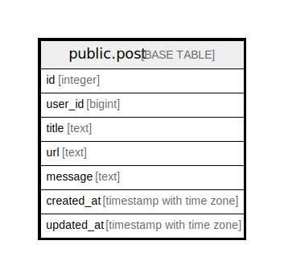

# public.post

## Description

## Columns

| Name | Type | Default | Nullable | Children | Parents | Comment |
| ---- | ---- | ------- | -------- | -------- | ------- | ------- |
| id | integer | nextval('post_id_seq'::regclass) | false |  |  | 投稿ID |
| user_id | bigint |  | false |  |  | ユーザーID |
| title | text |  | false |  |  | 投稿タイトル |
| url | text |  | false |  |  | 投稿URL |
| message | text |  | false |  |  | 投稿メッセージ |
| created_at | timestamp with time zone | now() | false |  |  | 作成日時 |
| updated_at | timestamp with time zone | now() | false |  |  | 更新日時 |

## Constraints

| Name | Type | Definition |
| ---- | ---- | ---------- |
| post_pkey | PRIMARY KEY | PRIMARY KEY (id) |

## Indexes

| Name | Definition |
| ---- | ---------- |
| post_pkey | CREATE UNIQUE INDEX post_pkey ON public.post USING btree (id) |

## Relations

---

> Generated by [tbls](https://github.com/k1LoW/tbls)
