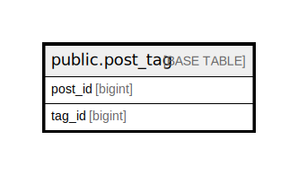

# public.post_tag

## Description

## Columns

| Name | Type | Default | Nullable | Children | Parents | Comment |
| ---- | ---- | ------- | -------- | -------- | ------- | ------- |
| post_id | bigint |  | false |  |  | 投稿ID |
| tag_id | bigint |  | false |  |  | タグID |

## Relations

---

> Generated by [tbls](https://github.com/k1LoW/tbls)
