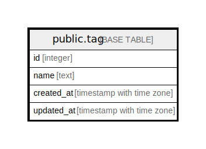

# public.tag

## Description

## Columns

| Name | Type | Default | Nullable | Children | Parents | Comment |
| ---- | ---- | ------- | -------- | -------- | ------- | ------- |
| id | integer | nextval('tag_id_seq'::regclass) | false |  |  | タグID |
| name | text |  | false |  |  | タグ名 |
| created_at | timestamp with time zone | now() | false |  |  | 作成日時 |
| updated_at | timestamp with time zone | now() | false |  |  | 更新日時 |

## Constraints

| Name | Type | Definition |
| ---- | ---- | ---------- |
| tag_pkey | PRIMARY KEY | PRIMARY KEY (id) |
| tag_name_key | UNIQUE | UNIQUE (name) |

## Indexes

| Name | Definition |
| ---- | ---------- |
| tag_pkey | CREATE UNIQUE INDEX tag_pkey ON public.tag USING btree (id) |
| tag_name_key | CREATE UNIQUE INDEX tag_name_key ON public.tag USING btree (name) |

## Relations

---

> Generated by [tbls](https://github.com/k1LoW/tbls)
