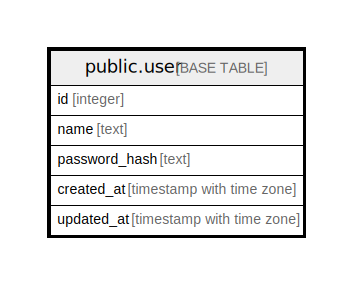

# public.user

## Description

## Columns

| Name | Type | Default | Nullable | Children | Parents | Comment |
| ---- | ---- | ------- | -------- | -------- | ------- | ------- |
| id | integer | nextval('user_id_seq'::regclass) | false |  |  | ユーザーID |
| name | text |  | false |  |  | ユーザー名 |
| password_hash | text |  | false |  |  | パスワードハッシュ |
| created_at | timestamp with time zone | now() | false |  |  | 作成日時 |
| updated_at | timestamp with time zone | now() | false |  |  | 更新日時 |

## Constraints

| Name | Type | Definition |
| ---- | ---- | ---------- |
| user_pkey | PRIMARY KEY | PRIMARY KEY (id) |
| user_name_key | UNIQUE | UNIQUE (name) |

## Indexes

| Name | Definition |
| ---- | ---------- |
| user_pkey | CREATE UNIQUE INDEX user_pkey ON public."user" USING btree (id) |
| user_name_key | CREATE UNIQUE INDEX user_name_key ON public."user" USING btree (name) |

## Relations

---

> Generated by [tbls](https://github.com/k1LoW/tbls)
